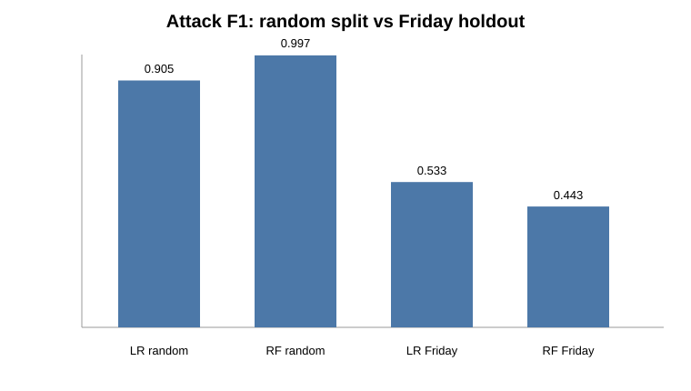
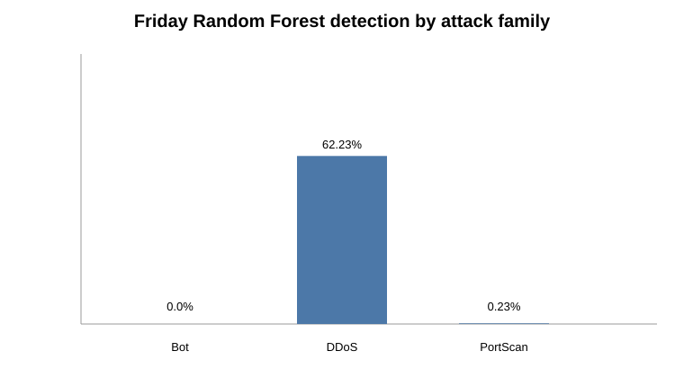
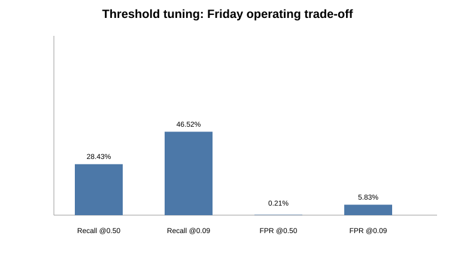

# Explainable AI for Network Intrusion Detection

Reproducible cybersecurity/AI research examining a common benchmark pitfall: a model can look nearly perfect under a random flow-level split while failing to generalize to traffic from different attack scenarios.

## Research question

**How accurately can supervised machine-learning models distinguish benign from malicious network traffic, which network features drive their predictions, and how robust are the models under cross-scenario distribution shift?**

## Key result

Using a deterministic **124,182-flow / 78-feature** development sample from CICIDS2017:

| Evaluation | Logistic Regression attack F1 | Random Forest attack F1 | Random Forest recall |
|---|---:|---:|---:|
| Random stratified split | 0.9049 | **0.9971** | **0.9971** |
| Friday cross-scenario holdout | **0.5327** | 0.4431 | **0.2854** |

Random Forest's attack recall falls from **99.71% to about 28.5%** under the harder holdout. Family-level analysis shows the model detects much of DDoS but almost completely misses Bot and PortScan in Friday traffic.



This does **not** prove that random splits are always invalid. It demonstrates that, for this CICIDS2017 experiment, the random split is substantially more optimistic than a cross-scenario stress test.

## Explainability

SHAP analysis of the Random Forest identifies Destination Port, packet-length statistics, and TCP initial-window features among the strongest drivers. These explain model behavior; they are not causal claims about attacks.

## Robustness experiments

- **Extra Trees:** better Friday ranking metrics in one run, but worse default-threshold attack recall.
- **Threshold tuning:** validation-selected threshold 0.09 raises Friday recall from 0.2843 to 0.4652, but Friday false-positive rate rises from 0.21% to 5.83%.
- **Class weighting:** 2x/4x attack weights do not materially repair Friday recall.
- **Attack-family analysis:** Bot and PortScan remain the dominant failure modes.





## Dataset

CICIDS2017 MachineLearningCSV, eight source CSVs and **2,830,743 flows** in the supplied archive. Raw benchmark data is excluded from Git. See `DATASET_PROFILE.md` and `data/README.md`.

The reported development experiment uses seed **42** and caps each source file at up to **10,000 benign + 10,000 attack flows**, preserving rare attacks and source-file provenance while fitting the available compute environment.

## Reproduce

```bash
python -m venv .venv
source .venv/bin/activate
pip install -r requirements.txt

# Put the eight MachineLearningCSV files in data/raw/
python -m src.train --data-dir data/raw --split-strategy random
python -m src.train --data-dir data/raw --split-strategy day-aware
pytest
```

The defaults now match the reported 10k/10k development sampling configuration.

## Repository

```
.
├── DATASET_PROFILE.md
├── RESEARCH_PLAN.md
├── RESULTS.md
├── FINAL_REPORT.md
├── data/README.md
├── figures/
├── results/
├── src/
│   ├── data.py
│   ├── train.py
│   ├── explain.py
│   ├── failure_analysis.py
│   └── threshold_analysis.py
└── tests/
```

## Research conclusion

The strongest contribution of this project is not the near-perfect random-split score. It is the demonstrated **generalization gap** and the failure analysis explaining where that gap appears. Threshold adjustment improves sensitivity at a substantial false-alarm cost, while class weighting does little, suggesting distribution/attack-family shift is more important here than ordinary binary imbalance.

The Friday holdout changes day, scenario, and attack-family composition simultaneously. It is therefore reported as a **cross-scenario generalization stress test**, not a pure temporal estimate.

Full metrics and caveats: **[RESULTS.md](RESULTS.md)**.

## Ethics

Defensive cybersecurity research only. Benchmark performance should not be interpreted as production readiness. SHAP importance is model-dependent and non-causal.

## Author

**Roshan Dhakal** — research portfolio project for graduate study in AI and cybersecurity.
